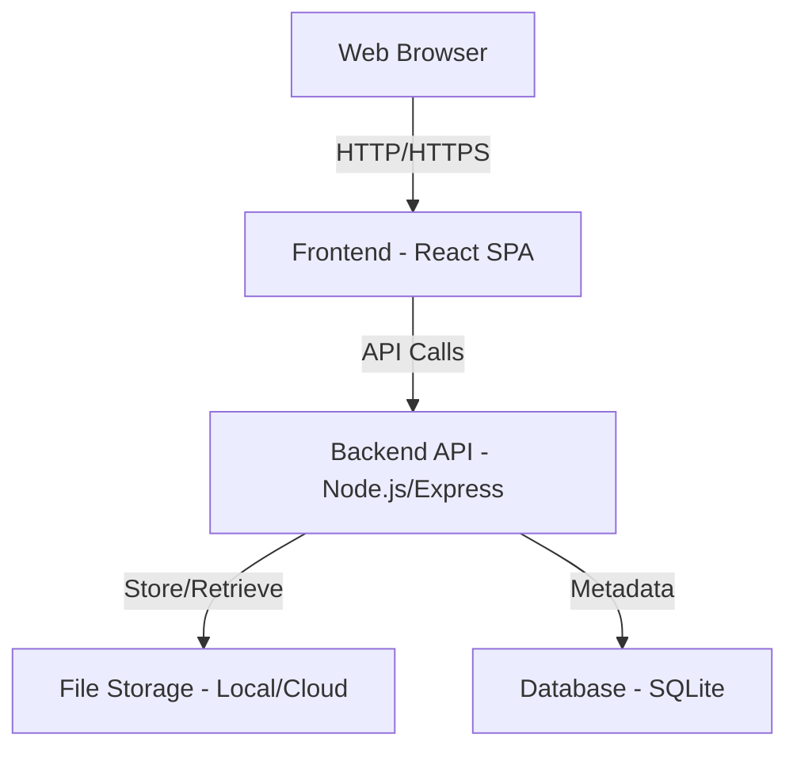

# Design Document: Document Sharing Platform

## Overview

The Document Sharing Platform is a web application that enables users to upload documents and share them via unique URLs. The system consists of a frontend web interface, a backend API server, and a file storage system. The architecture follows a client-server model with RESTful API design principles.

## Architecture

### High-Level Architecture



### Technology Stack

**Frontend:**
- React for UI components
- Axios for API communication
- React Router for navigation
- Tailwind CSS for styling

**Backend:**
- Node.js with Express framework
- Multer for file upload handling
- UUID for generating unique identifiers
- SQLite for metadata storage

**Storage:**
- Local file system (with option to extend to cloud storage like S3)

## Components and Interfaces

### Frontend Components

#### 1. Upload Component
- **Purpose**: Handle document uploads and display share links
- **Key Features**:
  - Drag-and-drop file upload
  - Multiple file selection
  - Upload progress indicator
  - Share link display with copy button
  - File type and size validation

#### 2. Viewer Component
- **Purpose**: Display documents from share links
- **Key Features**:
  - Document rendering (PDF viewer, image display, text display)
  - Download button
  - Multi-document list view
  - Error handling for invalid links

#### 3. Home Component
- **Purpose**: Landing page with upload interface
- **Key Features**:
  - Simple, clean interface
  - Instructions for use
  - Upload button/drop zone

### Backend API Endpoints

#### POST /api/upload
- **Purpose**: Handle document uploads
- **Request**: Multipart form data with file(s)
- **Response**: 
  ```json
  {
    "success": true,
    "shareId": "abc123xyz",
    "shareUrl": "https://domain.com/share/abc123xyz",
    "files": [
      {
        "originalName": "document.pdf",
        "size": 1024000
      }
    ]
  }
  ```
- **Validation**:
  - File size limit (50MB)
  - File type validation
  - Maximum number of files per upload

#### GET /api/share/:shareId
- **Purpose**: Retrieve metadata for a share
- **Response**:
  ```json
  {
    "shareId": "abc123xyz",
    "files": [
      {
        "id": "file1",
        "name": "document.pdf",
        "size": 1024000,
        "type": "application/pdf",
        "uploadDate": "2025-11-14T10:00:00Z"
      }
    ]
  }
  ```

#### GET /api/download/:shareId/:fileId
- **Purpose**: Download a specific file
- **Response**: File stream with appropriate headers

#### GET /api/view/:shareId/:fileId
- **Purpose**: Stream file for inline viewing
- **Response**: File stream with inline content disposition

## Data Models

### Share Model
```typescript
interface Share {
  id: string;              // Unique identifier (UUID)
  shareId: string;         // Public share identifier
  createdAt: Date;         // Upload timestamp
  expiresAt: Date | null;  // Optional expiration (future enhancement)
}
```

### File Model
```typescript
interface File {
  id: string;              // Unique file identifier
  shareId: string;         // Reference to parent share
  originalName: string;    // Original filename
  storedName: string;      // Filename on disk (UUID-based)
  mimeType: string;        // File MIME type
  size: number;            // File size in bytes
  uploadDate: Date;        // Upload timestamp
}
```

### Database Schema

**shares table:**
```sql
CREATE TABLE shares (
  id TEXT PRIMARY KEY,
  share_id TEXT UNIQUE NOT NULL,
  created_at DATETIME DEFAULT CURRENT_TIMESTAMP,
  expires_at DATETIME
);
```

**files table:**
```sql
CREATE TABLE files (
  id TEXT PRIMARY KEY,
  share_id TEXT NOT NULL,
  original_name TEXT NOT NULL,
  stored_name TEXT NOT NULL,
  mime_type TEXT NOT NULL,
  size INTEGER NOT NULL,
  upload_date DATETIME DEFAULT CURRENT_TIMESTAMP,
  FOREIGN KEY (share_id) REFERENCES shares(share_id)
);
```

## File Storage Strategy

### Storage Structure
```
uploads/
  ├── abc123xyz/
  │   ├── file1-uuid.pdf
  │   └── file2-uuid.png
  └── def456uvw/
      └── file3-uuid.docx
```

### File Naming
- Each share gets a unique directory named with the shareId
- Files are stored with UUID-based names to prevent conflicts and enhance security
- Original filenames are preserved in the database

### Security Considerations
- Share IDs use UUID v4 (128-bit random identifiers)
- Files are stored outside the web root
- Access only through API endpoints with validation
- No directory listing enabled
- MIME type validation on upload and download

## Error Handling

### Upload Errors
- **File too large**: Return 413 status with clear message
- **Invalid file type**: Return 400 status with supported types list
- **Storage failure**: Return 500 status with generic error message
- **No files provided**: Return 400 status with instruction

### Retrieval Errors
- **Share not found**: Return 404 status with user-friendly message
- **File not found**: Return 404 status
- **Corrupted file**: Return 500 status with error message

### Frontend Error Display
- Toast notifications for upload errors
- Error page for invalid share links
- Retry mechanisms for network failures

## Testing Strategy

### Unit Tests
- File validation logic (size, type)
- UUID generation uniqueness
- Database operations (CRUD)
- API endpoint handlers

### Integration Tests
- Complete upload flow (frontend → backend → storage)
- Share link generation and retrieval
- Multi-file upload scenarios
- Download functionality

### End-to-End Tests
- User uploads document and receives share link
- User shares link and another user views document
- User downloads document from share link
- Error scenarios (invalid links, unsupported files)

## Performance Considerations

### Upload Optimization
- Stream-based file uploads to handle large files efficiently
- Progress tracking for user feedback
- Chunked uploads for very large files (future enhancement)

### Download Optimization
- Stream-based file downloads
- Proper cache headers for static content
- Content-Disposition headers for download vs. inline viewing

### Scalability
- Stateless API design for horizontal scaling
- Database connection pooling
- File storage can be migrated to cloud storage (S3, Azure Blob) for production

## Deployment Considerations

### Environment Variables
```
PORT=3000
UPLOAD_DIR=./uploads
MAX_FILE_SIZE=52428800  # 50MB in bytes
DATABASE_PATH=./data/database.sqlite
FRONTEND_URL=http://localhost:5173
```

### Production Recommendations
- Use HTTPS for all connections
- Implement rate limiting on upload endpoint
- Set up CORS properly for frontend domain
- Use cloud storage for file persistence
- Implement file cleanup for expired shares
- Add monitoring and logging
- Use reverse proxy (nginx) for serving static files

## Future Enhancements

- Password protection for shares
- Expiration dates for shares
- View/download analytics
- User accounts for managing uploads
- Custom share URLs
- File preview generation (thumbnails)
- Bulk download as ZIP
- Mobile app
